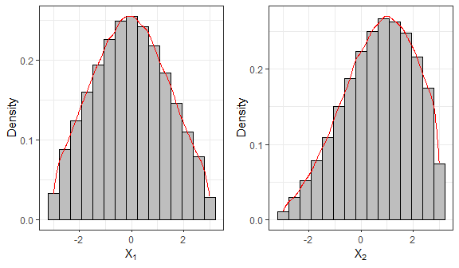
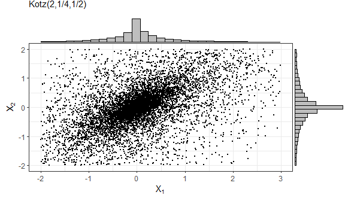
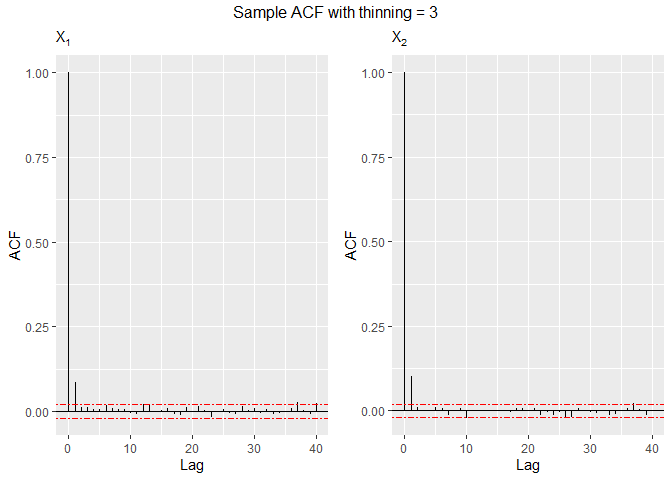
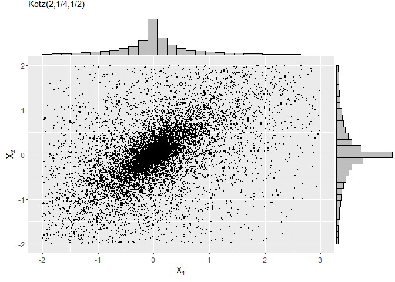

<!-- README.md is generated from README.Rmd. Please edit that file -->

# The `relliptical R` package

The `relliptical R` package performs random numbers generation from a
truncated multivariate elliptical distribution such as Normal, Pearson
VII, Slash, Logistic, Kotz-type, and others by specifying the density
generating function (DGF). It also computes first and second moments for
some particular truncated multivariate elliptical distributions.

## Installation

You can install the released version of `relliptical` from
[CRAN](https://CRAN.R-project.org) with:

``` r
install.packages("relliptical")
```

Next, we will show the functions available in the package.

## Sampling random numbers

The function `rtelliptical` generates observations from a truncated
multivariate elliptical distribution with location parameter equal to
`mean`, scale matrix `Sigma`, lower and upper truncation points `lower`
and `upper` via Slice Sampling algorithm (Neal 2003) with Gibbs sampler
(Robert and Casella 2010) steps. Through argument `dist`, it is possible
to get samples from the truncated Normal, Student-t, Pearson VII, Power
Exponential, Contaminated Normal, and Slash distribution.

In the following example, we generate

samples from the truncated bivariate Normal distribution.

``` r
library(relliptical)
library(ggplot2)
library(gridExtra)

# Sampling from the truncated Normal distribution
set.seed(1234)
mean  = c(0, 1)
Sigma = matrix(c(3,0.60,0.60,3), 2, 2)
lower = c(-3, -3)
upper = c(3, 3)
sample1 = rtelliptical(n=1e5, mean, Sigma, lower, upper, dist="Normal")
head(sample1)
#>            [,1]       [,2]
#> [1,]  0.6643105  2.4005763
#> [2,] -1.3364441 -0.1756624
#> [3,] -0.1814043  1.7013605
#> [4,] -0.6841829  2.4750461
#> [5,]  2.0984490  0.1375868
#> [6,] -1.8796633 -1.2629126

# Histogram and density for variable 1
f1 = ggplot(data.frame(sample1), aes(x=X1)) +
       geom_histogram(aes(y=..density..), colour="black", fill="grey", bins=15) +
       geom_density(color="red") + labs(x=bquote(X[1]), y="Density")

# Histogram and density for variable 2
f2 = ggplot(data.frame(sample1), aes(x=X2)) +
       geom_histogram(aes(y=..density..), colour="black", fill="grey", bins=15) +
       geom_density(color="red") + labs(x=bquote(X[2]), y="Density")
grid.arrange(f1, f2, nrow=1)
```



This function also allows generating random numbers from other truncated
elliptical distributions by specifying the density generating function
(DGF) through arguments `expr` or `gFun`. The DGF must be non-negative
and strictly decreasing on the interval (0, Inf). The DGF must be
provided as a character to argument `expr`. The notation used in `expr`
needs to be understood by package `Ryacas0` and the environment of `R`.
For example if the DGF is
=e^{-t}"),
then `expr="exp(1)^(-t)"`. In this case, the algorithm tries to compute
a closed expression for the inverse function of
"); and, a
warning message is returned when it is not possible. Additionally, the
function in `expr` must be written as a function depending only on
variable , and any
additional parameter must be given as a fixed value.

The following example draws random points from the truncated bivariate
Logistic distribution, whose DGF is
 = e^{-t}/(1+e^{-t})^2, t \geq 0"),
see (Fang 2018).

``` r
library(stats)

# Function for plotting the sample autocorrelation using ggplot2
acf.plot = function(samples){
 p = ncol(samples); n = nrow(samples); q1 = qnorm(0.975)/sqrt(n); acf1 = list(p)
 for (i in 1:p){
   bacfdf = with(acf(samples[,i], plot=FALSE), data.frame(lag, acf))
   acf1[[i]] = ggplot(data=bacfdf, aes(x=lag,y=acf)) + geom_hline(aes(yintercept=0)) +
     geom_segment(aes(xend=lag, yend=0)) + labs(x="Lag", y="ACF", subtitle=bquote(X[.(i)])) +
     geom_hline(yintercept=c(q1,-q1), color="red", linetype="twodash")
 }
 return (acf1)
}

# Sampling from the Truncated Logistic distribution
mean  = c(0, 0)
Sigma = matrix(c(1,0.70,0.70,1), 2, 2)
lower = c(-2, -2)
upper = c(3, 2)
set.seed(5678)
# Sample autocorrelation with no thinning
sample2 = rtelliptical(n=1e4, mean, Sigma, lower, upper, dist=NULL, expr="exp(1)^(-t)/(1+exp(1)^(-t))^2")
grid.arrange(grobs=acf.plot(sample2), top="Sample ACF with no thinning", nrow=1)
```



If the random observations are autocorrelated, it is recommended to use
the argument `thinning`. The thinning factor reduces the autocorrelation
of random points in Gibbs sampling. This value must be an integer
greater than or equal to 1.

``` r
set.seed(8768)
# Sample autocorrelation with thinning = 3
sample3 = rtelliptical(n=1e4, mean, Sigma, lower, upper, dist=NULL, expr="exp(1)^(-t)/(1+exp(1)^(-t))^2", 
                       thinning=3)
grid.arrange(grobs=acf.plot(sample3), top="Sample ACF with thinning = 3", nrow=1)
```



If it was impossible to generate random samples from the argument
`expr`, we could try through argument `gFun` by making `dist = 'NULL'`
and `expr = 'NULL'`. This argument accepts the DGF as an R function. The
inverse of the function can also be provided as an `R` function through
`ginvFun`. If `ginvFun = 'NULL'`, the inverse of `gFun` is approximated
numerically.

The next example shows how to get samples from the Kotz-type
distribution, whose DGF is given by

 = t^{N-1} e^{-rt^s}, \quad t\geq 0, \quad r>0, \quad s>0, \quad 2N+p>2.")

This function is strictly decreasing when
/2 < N \leq 1"),
see (Fang 2018).

``` r
library(ggExtra)

# Sampling from the Truncated Kotz-type distribution
set.seed(9876)
mean  = c(0, 0)
Sigma = matrix(c(1,0.70,0.70,1), 2, 2)
lower = c(-2, -2)
upper = c(3, 2)
sample4 = rtelliptical(n=1e4, mean, Sigma, lower, upper, dist=NULL, expr=NULL, 
                       gFun=function(t){ t^(-1/2)*exp(-2*t^(1/4)) })
f1 = ggplot(data.frame(sample4), aes(x=X1,y=X2)) + geom_point(size=0.50) +
     labs(x=expression(X[1]), y=expression(X[2]), subtitle="Kotz(2,1/4,1/2)")
ggMarginal(f1, type="histogram", fill="grey")
```



## Mean and variance-covariance matrix

For this purpose, we call the function `mvtelliptical()`, which returns
the mean vector and variance-covariance matrix for some specific
truncated elliptical distributions. The argument `dist` sets the
distribution to be used. The values are `Normal`, `t`, `PE`, `PVII`,
`Slash`, and `CN` for the truncated Normal, Student-t, Power
Exponential, Pearson VII, Slash, and Contaminated Normal distributions,
respectively. The moments are computed through Monte Carlo integration
for the truncated variables and using properties of the conditional
expectation for the non-truncated variables.

The following examples compute the moments for a random variable
, which follows
truncated multivariate Student-t distribution with
.
In the first example, we have one doubly truncated variable; and in the
second case, two doubly truncated variables.

``` r
# Truncated Student-t distribution
set.seed(5678)
mean = c(0.1, 0.2, 0.3)
Sigma = matrix(data = c(1,0.2,0.3,0.2,1,0.4,0.3,0.4,1), nrow=length(mean), ncol=length(mean), byrow=TRUE)

# Example 1: considering nu = 0.80 and one doubly truncated variable
a = c(-0.8, -Inf, -Inf)
b = c(0.5, 0.6, Inf)
mvtelliptical(mean, Sigma, a, b, "t", 0.80)
#> $EY
#>             [,1]
#> [1,] -0.11001805
#> [2,] -0.54278399
#> [3,] -0.01119847
#> 
#> $EYY
#>            [,1]       [,2]       [,3]
#> [1,] 0.13761136 0.09694152 0.04317817
#> [2,] 0.09694152        NaN        NaN
#> [3,] 0.04317817        NaN        NaN
#> 
#> $VarY
#>            [,1]       [,2]       [,3]
#> [1,] 0.12550739 0.03722548 0.04194614
#> [2,] 0.03722548        NaN        NaN
#> [3,] 0.04194614        NaN        NaN

# Example 2: considering nu = 0.80 and two doubly truncated variables
a = c(-0.8, -0.70, -Inf)
b = c(0.5, 0.6, Inf)
mvtelliptical(mean, Sigma, a, b, "t", 0.80)
#> $EY
#>             [,1]
#> [1,] -0.08566441
#> [2,]  0.01563586
#> [3,]  0.19215627
#> 
#> $EYY
#>             [,1]        [,2]       [,3]
#> [1,] 0.126040187 0.005937196 0.01331868
#> [2,] 0.005937196 0.119761635 0.04700108
#> [3,] 0.013318682 0.047001083 1.14714388
#> 
#> $VarY
#>             [,1]        [,2]       [,3]
#> [1,] 0.118701796 0.007276632 0.02977964
#> [2,] 0.007276632 0.119517155 0.04399655
#> [3,] 0.029779636 0.043996554 1.11021985
```

It is worth mention that the Student-t distribution with

degrees of freedom is a particular case of the Pearson VII distribution
with parameters

and

when
/2")
and
.
In the following example, we compute the moments for the truncated
Pearson VII distribution with parameters

and
/2 = 1.90"),
which has the same distribution as the last example.

``` r
# Truncated Pearson VII distribution
set.seed(9876)
a = c(-0.8, -0.70, -Inf)
b = c(0.5, 0.6, Inf)
mean = c(0.1, 0.2, 0.3)
Sigma = matrix(data = c(1,0.2,0.3,0.2,1,0.4,0.3,0.4,1), nrow=length(mean), ncol=length(mean), byrow=TRUE)
mvtelliptical(mean, Sigma, a, b, "PVII", c(1.90,0.80), n=1e6) # More precision
#> $EY
#>             [,1]
#> [1,] -0.08558130
#> [2,]  0.01420611
#> [3,]  0.19166895
#> 
#> $EYY
#>             [,1]        [,2]       [,3]
#> [1,] 0.128348258 0.006903655 0.01420704
#> [2,] 0.006903655 0.121364742 0.04749544
#> [3,] 0.014207043 0.047495444 1.15156461
#> 
#> $VarY
#>             [,1]        [,2]       [,3]
#> [1,] 0.121024099 0.008119433 0.03061032
#> [2,] 0.008119433 0.121162929 0.04477257
#> [3,] 0.030610322 0.044772574 1.11482763
```

## References

<div id="refs" class="references csl-bib-body hanging-indent">

<div id="ref-fang2018symmetric" class="csl-entry">

Fang, Kai Wang. 2018. *Symmetric Multivariate and Related
Distributions*. CRC Press.

</div>

<div id="ref-neal2003slice" class="csl-entry">

Neal, Radford M. 2003. “Slice Sampling.” *Annals of Statistics*, 705–41.

</div>

<div id="ref-robert2010introducing" class="csl-entry">

Robert, Christian P, and George Casella. 2010. *Introducing Monte Carlo
Methods with r*. Vol. 18. Springer.

</div>

</div>
